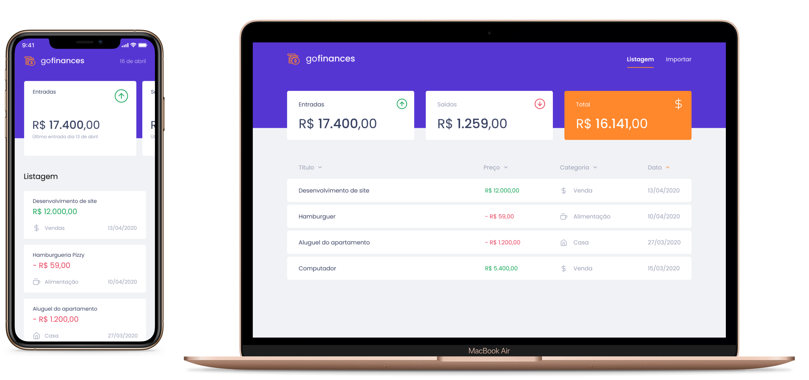

<h1 align="center">
  
</h1>

<h3 align="center">
  Finances control application
</h3>

<p align="center">
  <a href="#-about-the-project">About the project</a>&nbsp;&nbsp;&nbsp;|&nbsp;&nbsp;&nbsp;
  <a href="#-technologies">Technologies</a>&nbsp;&nbsp;&nbsp;|&nbsp;&nbsp;&nbsp;
  <a href="#-getting-started">Getting started</a>&nbsp;&nbsp;&nbsp;|&nbsp;&nbsp;&nbsp;  
  <a href="#-license">License</a>
</p>



## 💰 About the project

GoFinances is the application for who want to control your finances. With the feature to import a CSV (Comma-separated values) file you can bulk insert a lot of transactions.

## 🚀 Technologies

Technologies that I used to develop this api

- [Node.js](https://nodejs.org/)
- [ReactJS](https://reactjs.org/)
- [React Native](https://reactnative.dev/)
- [TypeScript](https://www.typescriptlang.org/)
- [TypeORM](https://typeorm.io/#/)
- [Express](https://expressjs.com/pt-br/)
- [PostgreSQL](https://www.postgresql.org/)
- [Jest](https://jestjs.io/)
- [SuperTest](https://github.com/visionmedia/supertest)
- [React Router DOM](https://reacttraining.com/react-router/)
- [React Navigation](https://reactnavigation.org/)
- [React Icons](https://react-icons.netlify.com/#/)
- [Styled Components](https://styled-components.com/)
- [Axios](https://github.com/axios/axios)
- [Eslint](https://eslint.org/)
- [Prettier](https://prettier.io/)
- [EditorConfig](https://editorconfig.org/)

## 💻 Getting started

<!-- Importe o arquivo `Insomnia.json` no Insomnia ou clique no botão [Run in Insomnia](#insomniaButton) -->

### Requirements

- [Node.js](https://nodejs.org/en/)
- [Yarn](https://classic.yarnpkg.com/)
- One instance of [PostgreSQL](https://www.postgresql.org/)

> Obs.: I recommend use docker

**Clone the project and access the folder**

```bash
$ git clone https://github.com/EliasGcf/gofinances.git && cd gofinances
```

**Install dependencies**

```bash
$ yarn
```

**Follow the steps below**

### Backend

```bash
# Create the instance of postgreSQL using docker
$ docker run --name gofinances-postgres -e POSTGRES_USER=docker -e POSTGRES_PASSWORD=docker -e POSTGRES_DB=gofinances -p 5432:5432 -d postgres

# Make sure the keys in 'packages/server/ormconfig.json'
# to connect with your database are set up correctly.

# Once the services are running, run the migrations
$ yarn server typeorm migration:run

# To finish, run the api service
$ yarn server dev:server

# Well done, project is started!
```

### Web

_Obs.: Before to continue, be sure to have the API running_

```bash
# Be sure the file 'packages/web/src/services/api.ts' have the IP to your API

# Start the client
$ yarn web start
```

## 📝 License

This project is licensed under the MIT License - see the [LICENSE](LICENSE) file for details.

---

Made with ♥ &nbsp;by Raphael Socolowski 👋 &nbsp;[See my linkedin](https://www.linkedin.com/in/raphaelswk/)
